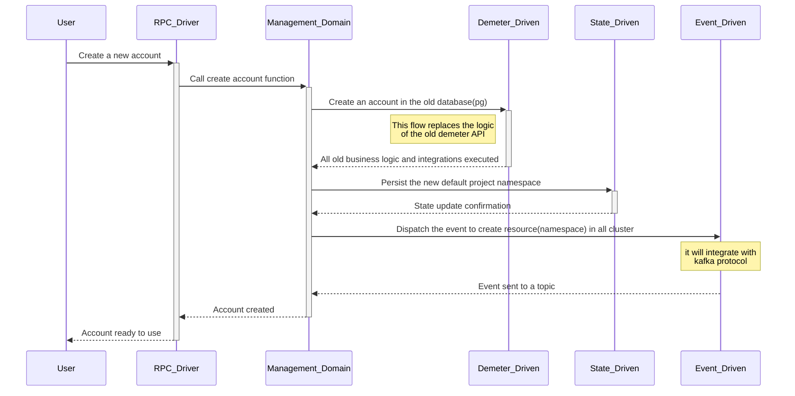

# Account Sequence Diagram

The flow to create a new account will use the management API as RPC. The process needs to integrate the old Demeter database to be compatible and doesn't break the old Demeter version. By default, the account creation will create a new project that will be a namespace in the Kubernetes cluster. Therefore, the Kafka protocol must be used to send events to all clusters available on Demeter. All Demeter clusters will be connected in the Kafka protocol to create all resources required.

## Management RPC flow

