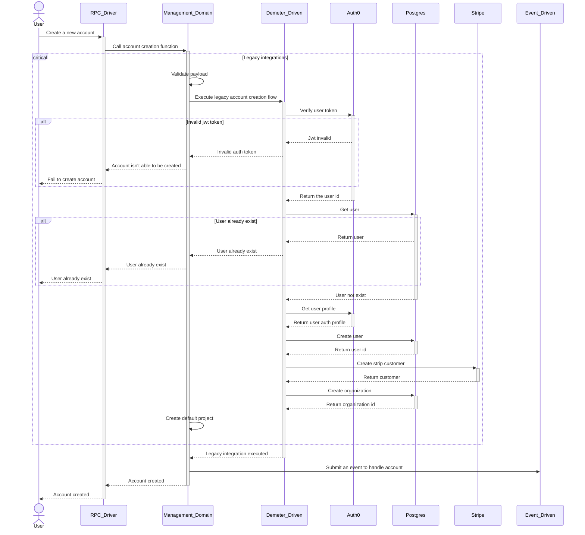

# Legacy Sequence Diagram

The new Demeter decentralized ecosystem needs to have support for the legacy, and some diagrams with legacy integrations are here to describe these flows.

## Account creation flow

The account creation flow needs to integrate with the legacy Demeter ecosystem, therefore this Diagram describes the flow to integrate.

