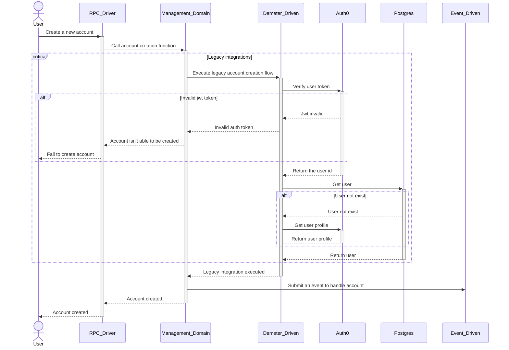

# Legacy Sequence Diagram

```mermaid
sequenceDiagram
    actor User

    User->>+RPC_Driver: Create a new account
    RPC_Driver->>+Management_Domain: Call account creation function

    critical Legacy integrations

        Management_Domain->>+Demeter_Driven: Execute legacy account creation flow
        Demeter_Driven->>+Auth0: Verify user token

        alt Invalid jwt token
            Auth0-->>Demeter_Driven: Jwt invalid
            Demeter_Driven-->>Management_Domain: Invalid auth token
            Management_Domain-->>RPC_Driver: Account isn't able to be created
            RPC_Driver-->>User: Fail to create account
        end

        Auth0-->>-Demeter_Driven: Return the user id
        Demeter_Driven->>+Postgres: Get user

        alt User not exist
            Postgres-->>Demeter_Driven: User not exist
            Demeter_Driven->>+Auth0: Get user profile
            Auth0-->-Demeter_Driven: Return user profile

            %% Mapping initialize user
        end

        Postgres-->>-Demeter_Driven: Return user
    end

    Demeter_Driven-->>-Management_Domain: Legacy integration executed
    Management_Domain->>Event_Driven: Submit an event to handle account
    Management_Domain-->>-RPC_Driver: Account created
    RPC_Driver-->>-User: Account created
```
