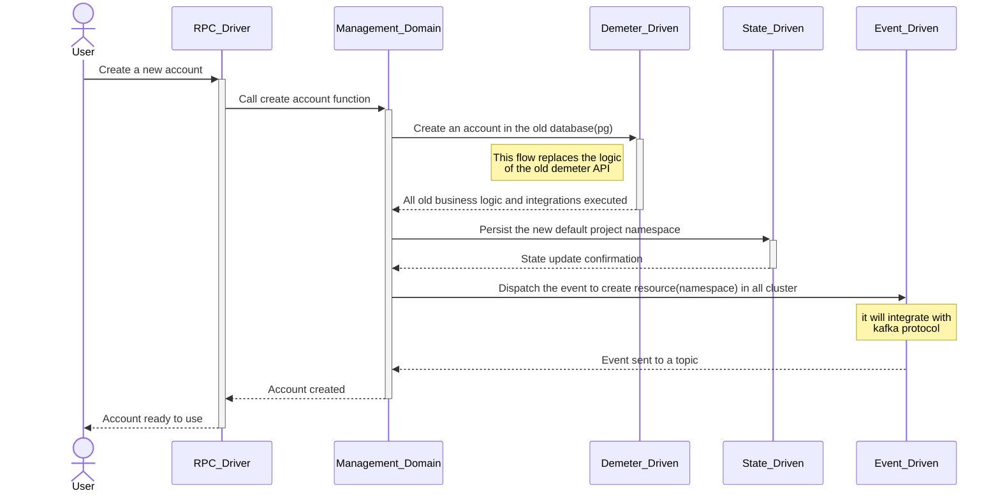
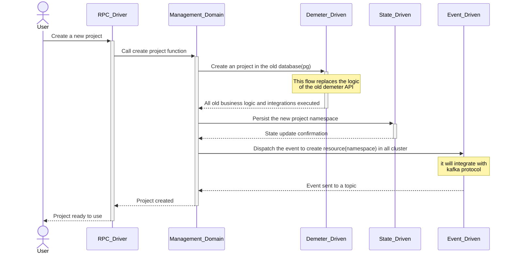
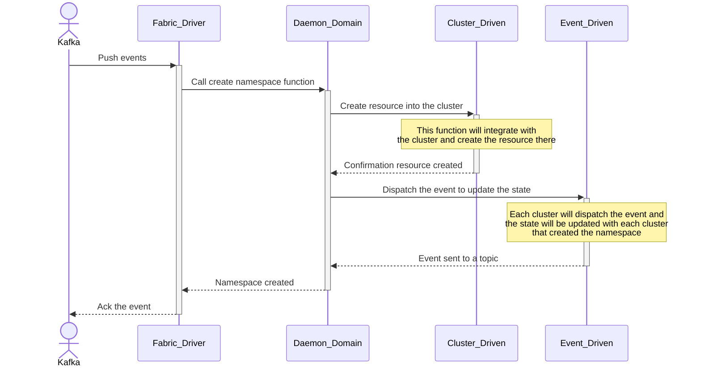

# Sequence Diagram

These diagrams show the flow of the processes into the architecture and how the flows will work.

## RPC account creation flow

The flow to create a new account will use the management API as RPC. The process needs to integrate the old Demeter database to be compatible and doesn't break the old Demeter version. By default, the account creation will create a new project that will be a namespace in the Kubernetes cluster. Therefore, the Kafka protocol must be used to send events to all clusters available on Demeter. All Demeter clusters will be connected in the Kafka protocol to create all resources required.

## RPC project creation flow

When the user needs to create a new project, the user will make an RPC to the management service that will create the project in the state and will send an event to create a project namespace in all clusters.

## Fabric resource creation flow

Each cluster will follow this flow to create resources, e.g. namespace and ports.

