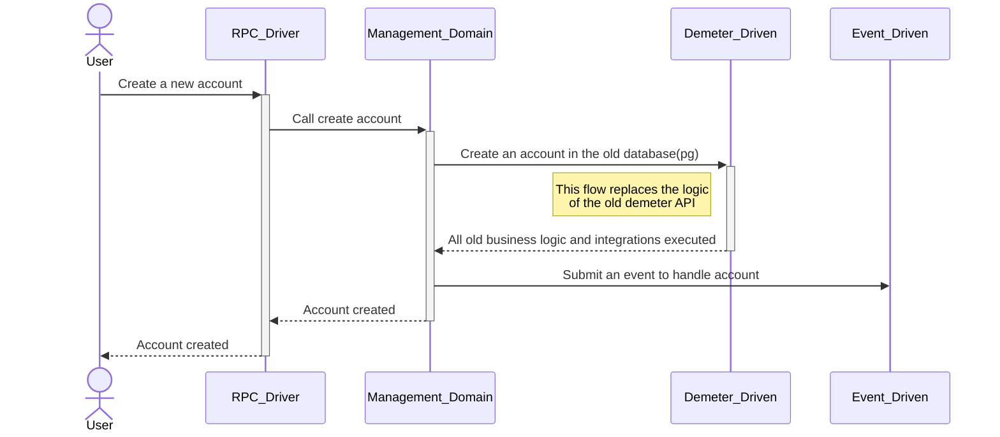
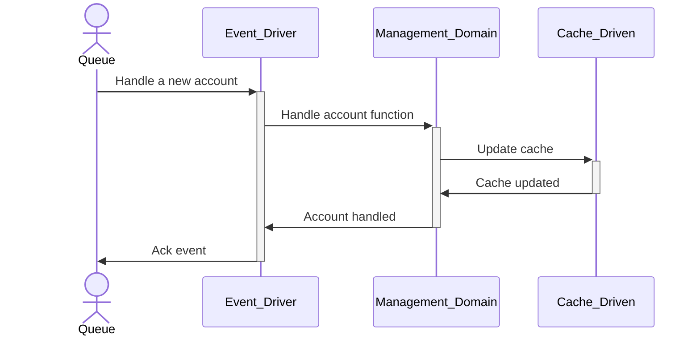
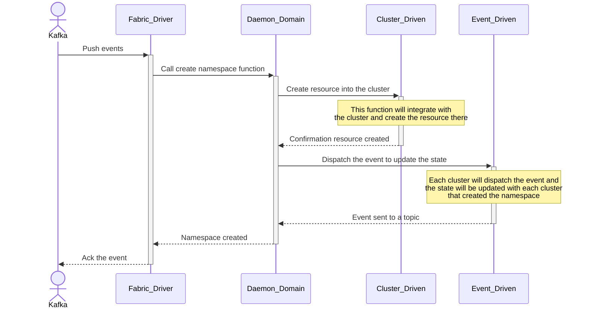
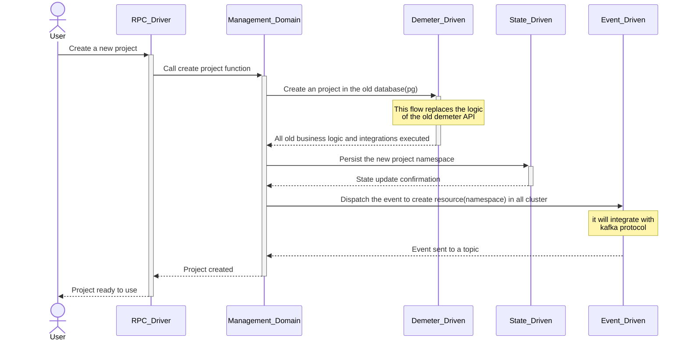
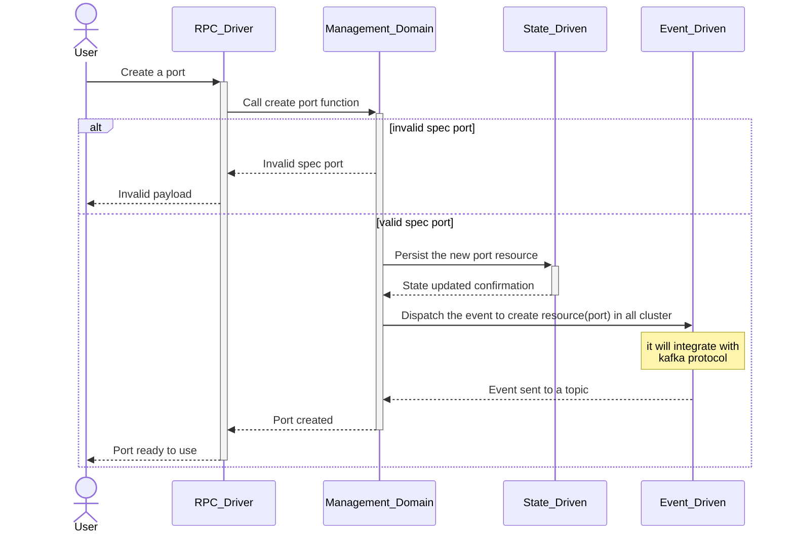
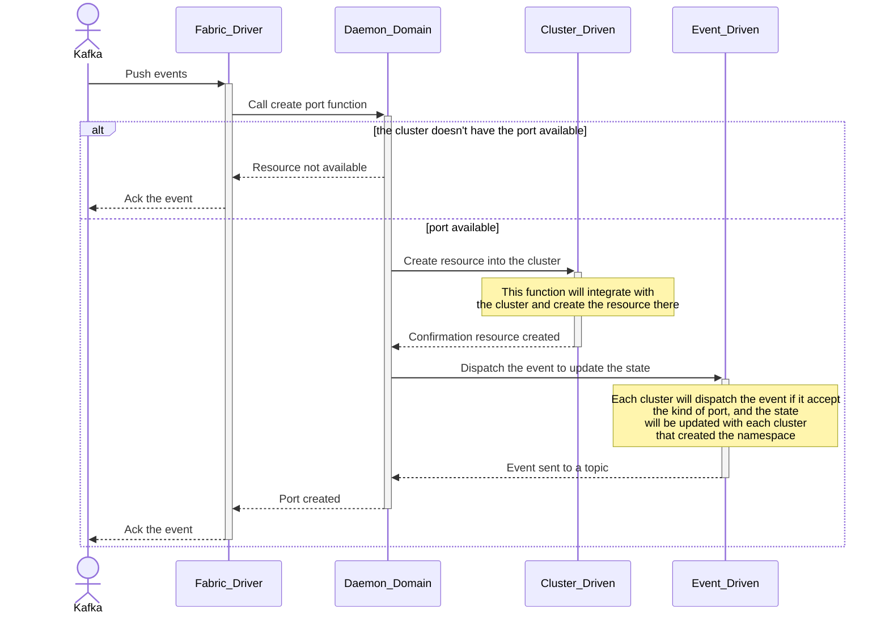

# Sequence Diagram

These diagrams show the flow of the processes into the architecture and how the flows will work.

## Account creation flow

An account will be persisted into the queue when the user call a creation. The RPC driver (management API) will persist a cache to manipulate and make query easly. And the daemon will create the resource in each cluster.

### RPC Driver

The RPC will call the domain to create the account where the domain will validate the information and integrate with the demeter legacy. When the account is created an event will be sent to the queue to handle the account creation.

### Event Driver

The event driver will be running togheter to the RPC driver watching the queue where it will handle account created.

### Daemon Driver

The Daemon Driver will be running in each cluster and watching the queue as well, but it will create the resource into the cluster.

## RPC project creation flow

When the user needs to create a new project, the user will make an RPC to the management service that will create the project in the state and will send an event to create a project namespace in all clusters.

## RPC port creation flow

The user will send the required payload to create a new port, the management will validate the payload and if it's true it will send an event to create the port in all cluster that accept this kind of port e.g. CardanoNodePort, KupoPort.

## Fabric namespace creation flow

Each cluster will follow this flow to create resources, e.g. namespace and ports.

## Fabric port creation flow

When the cluster receive the event to create a new port, the daemon need to validate if the port is available to create the resource in the cluster.

