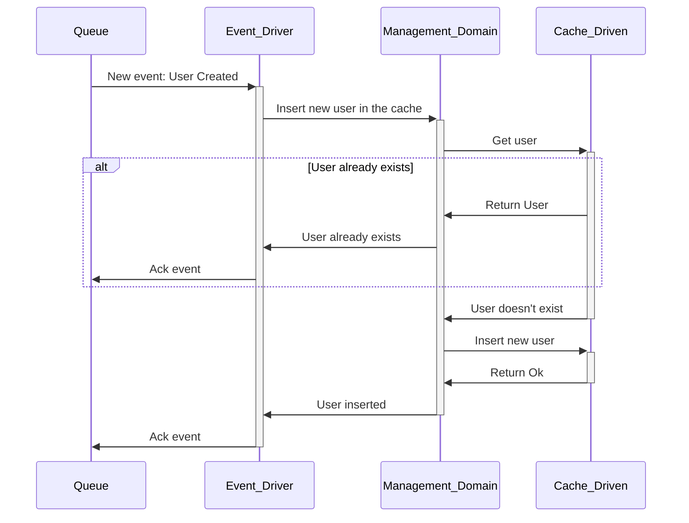

# Sequence Diagram

These diagrams show the flow of the processes into the architecture and how the flows will work.

## User creation flow

### RPC Driver

The user will first authenticate in OAuth and get an Access token. Then, the user will request the fabric to create the user or return the existing user.

### Event Driver

If all is ok, an event of the user created will be sent to a queue to persist that user. The event drive will be listening for events and will persist the user in the cache.

