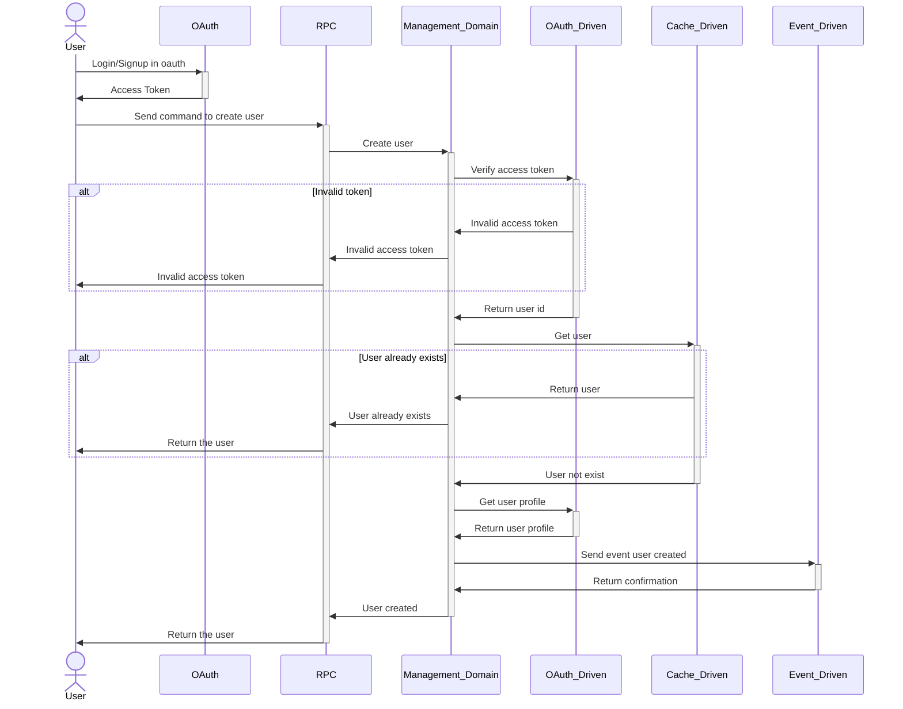

# Sequence Diagram

These diagrams show the flow of the processes into the architecture and how the flows will work.

## User creation flow

### RPC Driver


```mermaid
sequenceDiagram
    actor User

    User->>+OAuth: Login/Signup in oauth
    OAuth->>-User: Access Token

    User->>+RPC: Send command to create user
    RPC->>+Management_Domain: Create user

    Management_Domain->>+OAuth_Driven: Verify access token
    alt Invalid token
        OAuth_Driven->>Management_Domain: Invalid access token
        Management_Domain->>RPC: Invalid access token
        RPC->>User: Invalid access token
    end
    OAuth_Driven->>-Management_Domain: Return user id

    Management_Domain->>+Cache_Driven: Get user
    alt User already exists
        Cache_Driven->>Management_Domain: Return user
        Management_Domain->>RPC: User already exists
        RPC->>User: Return the user
    end
    Cache_Driven->>-Management_Domain: User not exist

    Management_Domain->>+OAuth_Driven: Get user profile
    OAuth_Driven->>-Management_Domain: Return user profile

    Management_Domain->>+Event_Driven: Send event user created
    Event_Driven->>-Management_Domain: Return confirmation

    Management_Domain->>-RPC: User created
    RPC->>-User: Return the user
```

### Event Driver

```mermaid

```
